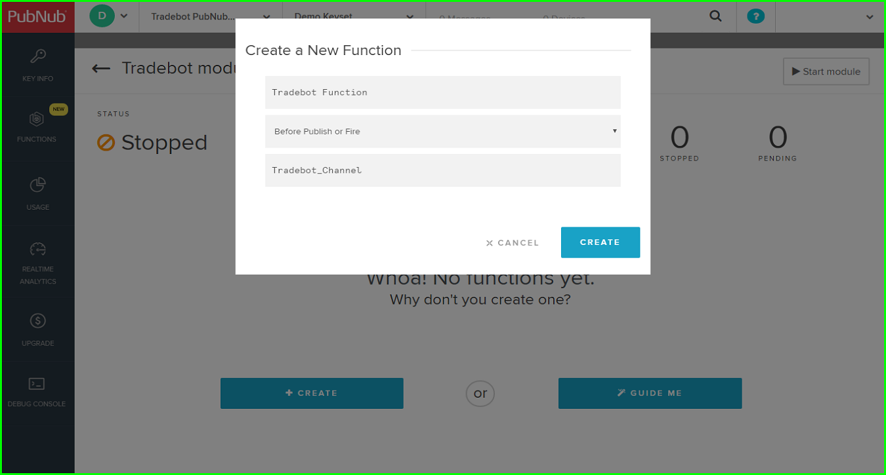

# Speech Enabled Bot Trading System Powered By IBM Watson 

A demo app for speech enabled trading bot using IBM Watson and PubNub

## Setup
To run this app, you will need to have your own IBM ID and a developer account on PubNub. Follow the steps below to setup the IBM Text to Speech service and a PubNub function block.


### Setup IBM Text to Speech Service

#### Step 1:

Log on to [IBM Bluemix](https://console.bluemix.net/) with your IBM ID and go to catalog, then select "Text to Speech" under Watson services.


#### Step 2:

Enter a name for the service and the service credential. Leave the field 'Connect to' as 'Leave unbound'.


Scroll down and select 'Standard pricing plan' and then click on 'Create'.


#### Step 3:

From the service page, go to 'Service credentials' and click on 'View credentials'. It will show a json object with url, username and password for your service.
The username and password are unique to your service instance created. Make note of these as we will use them later while setting up the PubNub function.


### Setup PubNub Function 

#### Step 4:

Login to [PubNub admin portal](https://admin.pubnub.com) with your PubNub account.


#### Step 5:

From the dashboard, create a new app by clicking on 'CREATE NEW APP +' and give some name to your app.


#### Step 6:

Click on your newly created app. A demo keyset is already created for you.


Click on the keyset and copy both the publish and subscribe keys. We will need them while running the app.


Go to 'FUNCTIONS' (on the left side bar). There are no modules for the newly created app yet.


Create a new module by clicking on '+ CREATE MODULE'. Give some name and description for your new module. Leave the keyset as default and click on 'CREATE'.


The module is created now.


#### Step 7:

Now we will create a function inside this module. Click on the newly created module. There are no functions for this module yet.
Create a new function by clicking on '+ CREATE'.


Give some name to the function.
Select the event as 'Before Publish or Fire'. This ensures that the text to speech conversion is done before a message is sent to subscriber devices.
Give the channel name as 'Tradebot_Channel'. 



The newly created function will have some default code.


#### Step 8:

Replace the default code with contents of the [PubNub Function code](pubnub/pubnub_function.js)

#### Step 9:

On lines 10 and 11 of this function code, replace the username and password with your IBM Text to Speech service credentials.
Click on 'SAVE' (on left side) and then click on 'Start module' to start running the function.


#### Step 10:

The newly created function is now running as you can see in the log messages. If you wish, you can test it using the sample testload shown on left hand side.


### Running the app

We have created IBM Text to Speech service instance and also deployed a PubNub function for accessing the service. Now let's go ahead and run our Tradebot app.
Before you run the code, make sure you have [Node.js V6.11.1+](https://nodejs.org/en/) installed on your computer. 

#### Step 11:

Clone or download this github repo.

#### Step 12:

Install required modules.

```npm install```

#### Step 13:
Configure your local environment
Create a text file in the 'app' folder and name it as ‘.env’. Populate the file with your PubNub keys and chanel name as shown below.
Replace the PubNub keys with the publish and subscribe keys obtained in step 6 above.
```
PUB_NUB_CHANNEL_KEY = 'Tradebot_Channel'
PUB_NUB_PUBLISH_KEY= 'YOUR_PUBNUB_PUBLISH_KEY'
PUB_NUB_SUBSCRIBE_KEY = 'YOUR_PUBNUB_SUBSCRIBE_KEY'
```
Note that we had used channel name as 'Tradebot_Channel' earlier while creating PubNub function. The same name should appear in this file. Channel names are case sensitive.

#### Step 14:

Run the script tradebot.js first to subscribe to PubNub messages. It should output a message indicating that it has subscribed to the required channel.
```
node tradebot.js
```


#### Step 15:
In another terminal window run the stock simulating script.
 ```
 node stockexchange.js
 ```

The other script tradebot.js will now receive and playback a welcome audio message.

Wait for a while and you will see the stock prices getting changed. Once a stock price moves beyond threshold, you should hear corresponding speech message from the trading bot script. Note that since the price movement is random, you may have to wait a while before a stock crosses some threshold.


If you are interested in knowing how the app works or how to customize the app, the [README](app/README.md) file in app folder has more details.
